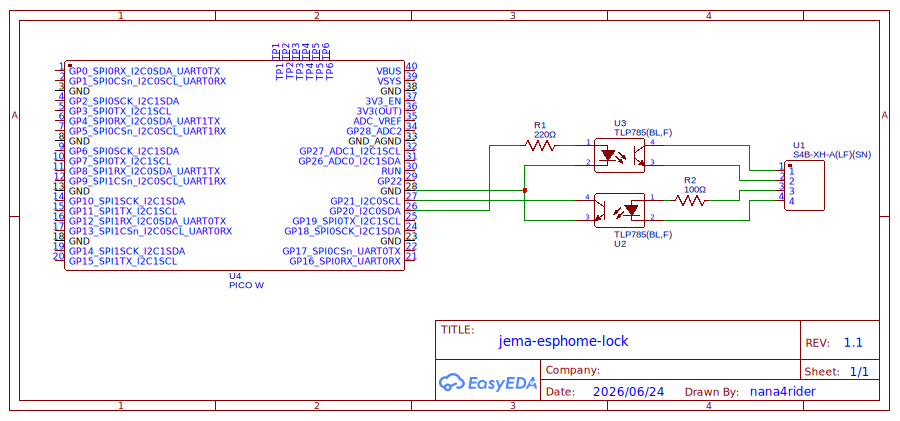

# JEM-A ESPHome Lock

## 概要

JEM1427(HA端子、JEM-A端子)をGPIOに接続し、Home Assistantで操作するためのドキュメントです。

Raspberry Pi Zero 2 Wに下記の回路を取り付けることで動作します。

## 回路図

## 必要な部品

- [XHコネクタ ベース付ポスト サイド型 4P](https://akizukidenshi.com/catalog/g/g112842/) x1
- [フォトカプラ TLP785(BLランク)](https://akizukidenshi.com/catalog/g/g109846/) x2
- [カーボン抵抗(炭素皮膜抵抗) 1/4W220Ω](https://akizukidenshi.com/catalog/g/g125221/) x1
- [L型ピンソケット 1x6](https://akizukidenshi.com/catalog/g/g109862/) x1
- [ユニバーサル基板](https://akizukidenshi.com/catalog/g/g112188/) x1
